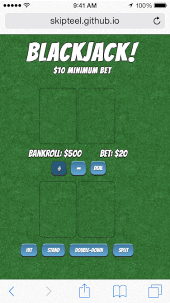

##Blackjack

- Blackjack is a game of chance and skill, and in this exciting version of the game, one player is pitted against the dealer
- The aim of the game is to obtain a higher score than the dealer, without going over 21
- Like most casinos, a minimum bet of $10 is required to play a hand, and the player can increase or decrease the bet in increments of $10, up to the amount left in the bankroll.
- The player has the option to cash out at any point, and a message will display the profit or loss for the session
- There are several general rules of the game whose logic are built into the app:
  * The dealer must hit on a 16 and stand on a 17
  * An ace can be used as a 1 or an 11, and the logic automatically decides which is appropriate
  * An unmatched blackjack on the initial deal pays 3/2 odds
  * The player has the option to "double-down", or double the bet and receive one additional card
  * A tie or push results in the bet being returned to the player
  * Like many casinos, the deck is shuffled when 75% of the cards have been dealt. Later version will support the option to play with multiple decks.
- When the player goes broke, they are given the option to buy back in
- Enhanced functionality will be included in later versions of the app, such as the option to "split" -  or play two separate hands when dealt two cards with the same number
- Later versions will also provide complete functionality on all portable devices
- Currently, the app is available on laptop, desktop, and iPhone(portrait)

---


---

##url

http://skipteel.github.io/Blackjack/

---

##Wireframe


##User Stories

1. As a user, I want to be able to take another card, so that I can try to get a tally closer to 21.
2. As a user, I want to be able to stop taking cards, so that I can see if I made a better tally than the dealer.
3. As a user, I want to be able to bet a certain amount before each game, so that I can double my money and feel awesome when I win.
4. As a user, I want to be able to see how much money I have in my wallet, so that I can make a better decision about how much I want to bet.
5. As a user, I want to be able to see one of the dealer's cards, so that I can make a better decision about whether I want to hit or stand.
6. As a user, I want to be able to see both of my cards, so that I can decide whether to hit, stand, double-down, or split.
7. As a user, I want to be able to split if I have two of the same number, so that I can try and win with two different hands.
8. As a user, I want to be able to double-down and get one more card, so that I can try to win double the money.
9. As a user, I want to be able to see the cards being dealt from a deck, so that I can feel more like I am in an actual casino.


##Technologies

* HTML
* CSS
* Javascript
  * jQuery
  * jQueryUI

***



---
##Code Examples

* `checkForAce()` is called during each draw of a card following the initial deal. If the hand's value is over 21, the hand is checked for an ace, and if one is found, its value is changed from an eleven to a one. If more than one ace is found, only the first one whose value is an eleven is affected.

```
BlackjackGame.prototype.checkForAce = function checkForAce(playerTakingCard) {
  if (this.isBusted(playerTakingCard)) {
    var playerHand = playerTakingCard.hand.cards;
    for (var i = 0; i < playerHand.length; i++){
      if (playerHand[i].name.charAt(0)==='A' && playerHand[i].value === 11){
        playerHand[i].value = 1;
        playerTakingCard.hand.total = playerTakingCard.handValue();
        break;
      }
    }
  }
};
```
* `getHand()` returns a hand to the player or dealer. The returned hand is an object with an array of cards that initially contains two randomly drawn card objects. The object also contains a hand total, which is thereafter calculated in a separate function.

```
BlackjackGame.prototype.getHand = function getHand (playerorDealer) {
  var hand = {};
  hand.cards = []
  hand.cards.push(this.dealRandomCard());
  hand.cards.push(this.dealRandomCard());
  hand.total = hand.cards[0].value + hand.cards[1].value;
  return hand;
};
```

* `playerWins()` is called when the player has won the hand. A message is displayed, the bankroll property is adjusted to include the hand's winnings, the bankroll display is updated, and the listeners are reset.

```
BlackjackGame.prototype.playerWins = function playerWins () {
  this.outcomeMessage("YOU WIN!");
  this.bankRoll += 2*this.bet;
  this.updateBankRoll();
  this.resetListeners();
};
```


